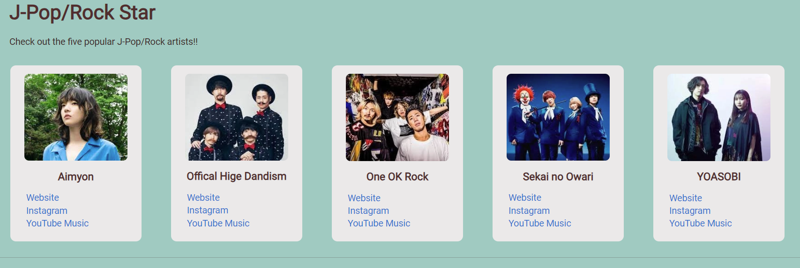
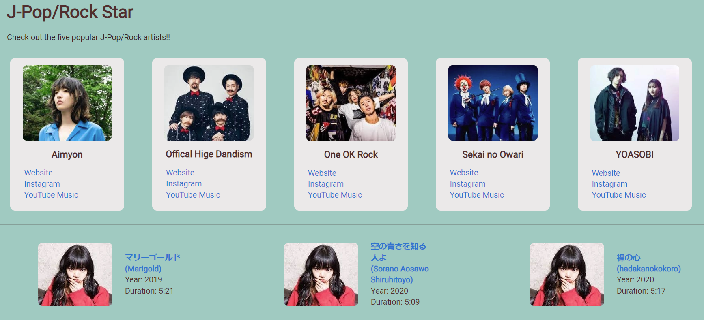
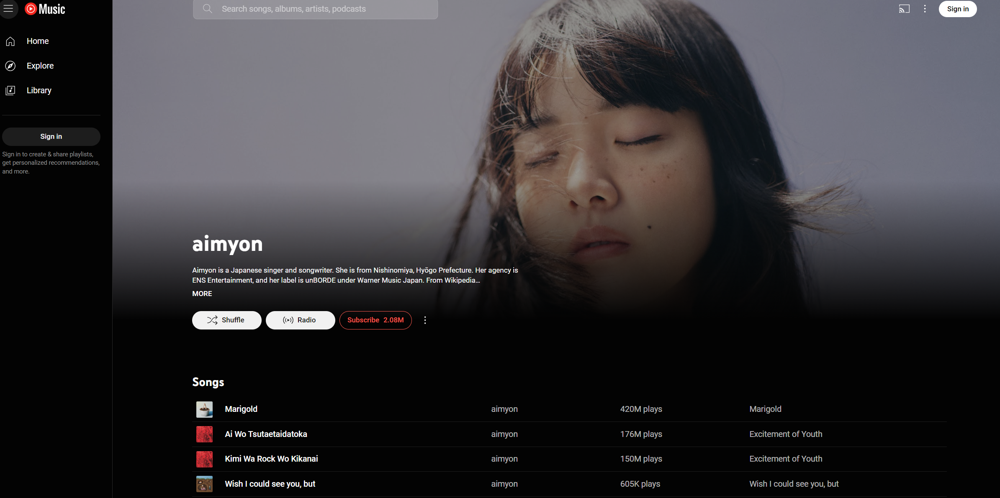

# **J-Pop/Rock Star Web Application**

## **Overview:** 
The J-Pop/Rock Star web-based platform offers users an immersive experience to explore and engage with J-Pop/Rock artists and songs. With features like dynamic artist cards, user interaction enhancements, and detailed song information, the application provides a seamless platform for J-Pop/Rock enthusiasts to discover music and connect with their favorite artists.

## **Key Features**

**JavaScript Integration:**

The functionality of the application is primarily integrated within the **`index.html`** file, where JavaScript code is included within **`<script>`** tags. DOM manipulation techniques such as **`createElement`**, **`appendChild`**, and **`getElementById`** are utilized directly within the HTML file to dynamically generate artist cards and song details based on user interactions. These methods enable the application to dynamically update the HTML content in response to user actions, providing an interactive and seamless user experience.

**Artist Cards:**

The homepage displays artist cards for five popular J-Pop/Rock artists: Aimyon, Official Hige Dandism, One OK Rock, Sekai no Owari, and YOASOBI. Each artist card includes the artist's name, an image, and links to their official website, Instagram profile, and YouTube Music channel. Users can click on an artist card to view details about the artist and their songs.

**Song Details:**

Upon clicking on an artist card, users are presented with details about the selected artist, including their name and a list of songs. Each song card displays the song title, release year, duration, and a link to listen to the song on YouTube. Users can click on a song card to listen to the song or access additional information.

## **Views**

- **index.html:** The homepage of the application displays artist cards for five popular J-Pop/Rock artists. Users can click on an artist card to view details about the artist and their songs.
- **Artist Details:** Upon clicking on an artist card, users are directed to a page displaying details about the selected artist, including their name and a list of songs. Each song card contains information about the song title, release year, duration, and a link to listen to the song on YouTube.

## **Data Files**

- **artists.js:** Contains an array of objects representing J-Pop/Rock artists. Each object includes the artist's name, unique identifier (artistId), and URLs to their official website, Instagram profile, and YouTube Music channel.
- **songs.js:** Includes an array of objects representing songs by the J-Pop/Rock artists. Each object contains the song title, unique identifier (songId), artist identifier (artistId), release year, duration, URL to listen to the song on YouTube, and explicit content status.

## **Summary**

The J-Pop/Rock Star web application offers users an immersive experience to explore and engage with their favorite J-Pop/Rock artists and songs. With features like dynamic artist cards, user interaction enhancements, and detailed song information, the application provides a seamless platform for J-Pop/Rock enthusiasts to discover new music and connect with their favorite artists.